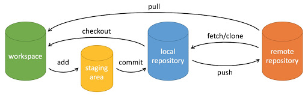

# Github与代理加速

## 什么是Git？
一款分布式源代码管理工具(版本控制工具)。它可以帮助我们记录每个版本的代码，实现代码回溯、版本合并、代码同步等功能。



- workspace：工作区，即本地的文件夹
- local repository：版本库或本地仓库（一个虚拟的仓库，类似conda的虚拟环境，你可以在多个分支之间切换）
- remote repository：云端远程仓库，即登陆github网站看到的仓库

## 如何使用
**需要明确，Git是一个版本管理工具，因此不一定非要有云端仓库才能使用。**
## 本地仓库
1. 创建一个工程文件夹，名为`project`。初始化本地仓库。
```bash
# 所有git操作都要在工作文件夹下，以下省略。
cd ./project
git init
# 运行之后，git就知道这个文件夹是一个需要被管理的工作区了。
```
2. 创建一个文件`main.py`，随便编辑一下。现在我们需要将文件提交到本地仓库。
```bash
# 添加文件到暂存区，add指令可以分次执行
git add main.py
# 或者，如果你想添加一个文件夹下的所有文件，可执行以下指令
git add dir/*

# 将暂存区的文件提交,建议写清楚提交内容，便于阅读
# commit命令只需要执行一次，就会把之前add的都加入本地仓库
git commit -m "create main file"
```
这样，一个版本的更新就做好了。

3. 假如我们误删或者想撤销之前commit的东西：
```bash
# 查看之前的提交记录
git log

# 找到你要回溯的版本号（就是commit后面的那串字符）
git reset --soft或者--hard或者--mixed [版本号]
# soft：保留内容，不退回add内容，只退回commit提交的内容。当我们“不小心还没add完毕，就commit”时使用
# hard：不保留内容，强制退回之前版本。用于业务出入很大的时候，由于文件会被强制回溯，慎用
# mixed：保留内容，退回add内容，也退回commit提交的内容。建议一般使用这个。
```

### 分支
如果你使用vscode开发，你可以在左下角看到当前在哪个分支下。
**一般来说，主分支master的代码是始终保持可执行、没有bug的。** 如果我们想开发一个新的功能，我们希望复制一份master的代码，开发完成后，再把代码合并入master。这就是分支的意义。
```bash
# 创建一个分支
git branch new_branch
# 切换到新分支
git checkout new_branch
# 此时，新分支的内容和原来的内容，还是一样的，新建一个test.py文件，我们再切回主分支。
git checkout master
# 你会发现内容又回到了原来的样子。可以理解为现在两个分支是并行的。

# 当我们顺利开发完一个功能，我们想把分支合并到master去，可以使用merge
git checkout master
git merge new_branch

# 如果想删除分支
git branch -D new_branch
```
除了merge外，rebase也可以用于合并分支，但两者具有本质的区别：
- merge：吞并。master吞并branch，因此需要在master下操作。
- rebase：变基。在分支下，变基到master。
  
相对复杂的应用情况，详见[传送门](https://zhuanlan.zhihu.com/p/493953965)。<br>
<font color='red'> 在你没有完全理解两者的前提下，不要用rebase！！！ </font>


## 远程仓库
1. 首先，创建一个远程仓库。登录Github，创建一个新的仓库，名为example。设置随便填。（其实其它的代码托管平台也是基于git的，如gitlab，但远程处理的机制上有些许差别，读者可以自己拓展探索。）
2. 关联远程仓库。我们需要告诉本地的git，我们的本地仓库A和远程仓库B是联系起来的。
```bash
# origin是我们给这个远程库起的名字，一般默认这个名字。
git remote add origin git@github.com:[用户名]/[仓库名].git
```
3. 然后我们把之前本地仓库的内容推送到远程仓库。注意，你要push哪个分支，就checkout到那个分支再push。
```bash
# origin就是我们刚刚关联的远程库，master是远程库的master分支
git push -u origin master
# -u是将本地分支名和远程分支名关联起来，所以以后可以不加-u
git push origin master

# push的完整指令是
git push <远程主机名> <本地分支名>:<远程分支名>
# 如果本地分支名与远程分支名相同，则可以省略冒号：
git push <远程主机名> <本地分支名>
```
4. 对于多人开发的场景，假设有另一位卷王在你睡大觉的时候也往云端推送了代码，那我们本地的master分支会落后远程的master几个版本。因此，我们可以使用pull指令，从远程同步代码：
```bash
git pull <远程主机名> <远程分支名>:<本地分支名>
```

## 代理加速
代理加速只能帮助临时场景应付一下，比如：ubuntu系统上git clone一个已知名字的工程、本地pull/push。
1. 方法一：[传送门](https://ghproxy.com)
2. 方法二：将github网址中的github改为`githubfast`。
以上两种代理方式，对于私有仓库都需要使用access tokens。登录github -> setting -> developer settings -> personal access tokens -> tokens。

